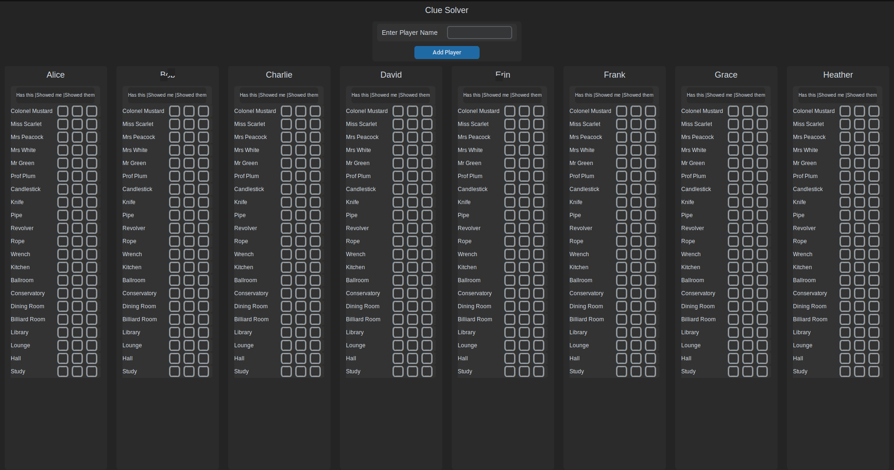

## Solver/Helper for the board game clue written in python using the customtkinter library 

This is a tool I made so I could better track who gave me what information in the board game Clue



Make sure to run this command first to get any missing dependencies
```
pip install -r requirements.txt
```